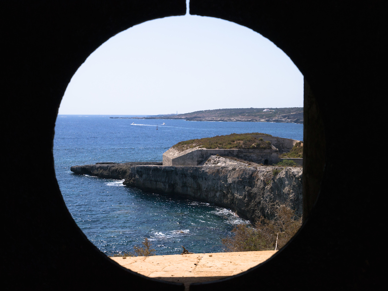

# porthole

A dashboard presented as a web page that shows the most recent album additions to a record collection. It is intended to run on a Raspberry Pi.

* Installation instructions are [here](PI.md)
* Once porthole is installed on the Pi, every time the Pi is turned on it updates porthole to the latest version by pulling the source from GitHub and doing a full build, then starts the app.
* Golang was used because it is easily installed via apt-get and it is very fast both when compiling and running.
* A file specified by the KNOWN_ALBUMS_FILE environment variable is used to keep track of what as been added to the record collection, in order. New album additions are added to the bottom of the file.
* The record collection must be arranged in folders where each album is a subfolder of the artist responsible.
* The folder names are all that is used to determine the artist name and album name. The app does not care about audio files or embedded metadata.
* Use the FOLDERS_TO_SCAN environment variable to indicate any number of locations where albums are found, separated by commas.
* Each location in FOLDERS_TO_SCAN is split into `<root>:<depth>` where `<depth>` indicates how many levels beneath `<root>` the album folders can be found. This allows for splitting the collection by each artist's first letter.

# implementation

* The dashboard html page periodically calls the /dashinfo endpoint, the response of which is used to fill an 'infoarea' div.
* The /dashinfo endpoint serves a template whose dynamic content is the 'status' object, and it also sets the status object's LastRequest timestamp value to now.
* The status object is a member of StatusCoordinator and is used to store the result of a scan and related information.
* Every FETCH_INTERVAL, a time.Tick is emitted and StatusCoordinator tries to do work, which it will do unless the time from LastRequest until tick exceeds SLEEP_AFTER.
* An album is an individual recording represented by a folder on the filesystem at the specified depth for each folder to scan.
* The work consists of scanning the filesystem for albums, comparing the scan results to a list of known albums, and returning a complete list of known albums with the latest album additions at the top.

# improvements

* Use seconds for time values in config (is it currently milliseconds?)
* StatusCoordinator only does work when user presses button. Introduce /scan endpoint that sets LastRequest and stop doing that in /dashinfo
* Display to the user whether the app is working or sleeping
* Deprecate Dashboard refresh interval - prefer manual refresh